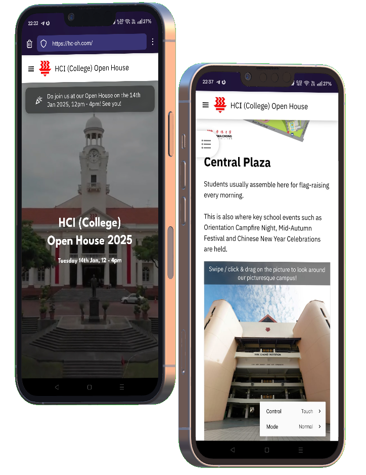
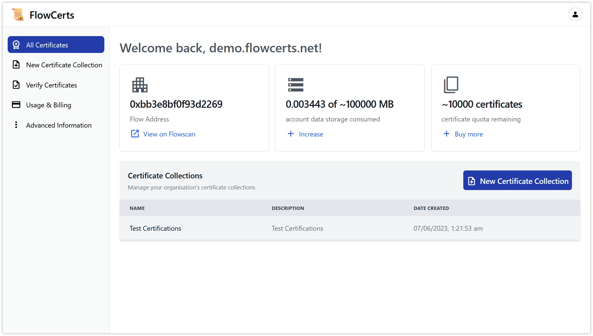
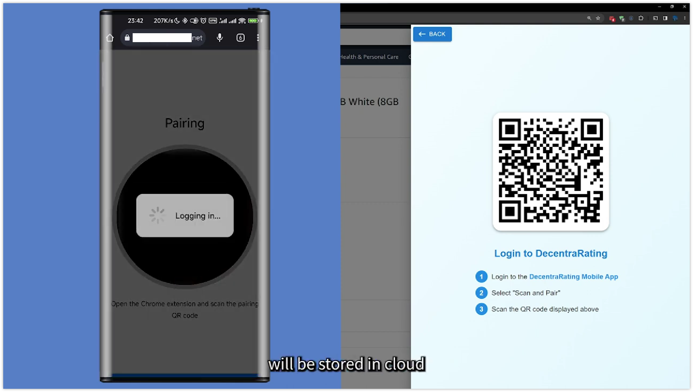

# Certifications

- **Huawei Certified ICT Associate (Cloud Service)** - certified as an HCIA - Cloud Service engineer, able to create an IT architecture using common compute, storage, and networking cloud services.

- **AWS Certified Cloud Practitioner** - obtained in 2022, verifiable at https://www.credly.com/badges/44ab9ff8-350b-4c93-bb84-56d7457ebc1e

# Notable Projects

<table>
<tr>
<td>

## Internal apps and public-facing websites for Hwa Chong Institution, Singapore

Developed several aesthetically pleasing informational websites with dynamic features such as newsletter signup and mobile-friendly design

- Work closely with clients to realise their vision for each product
  - timely updates and discussions to fine tune UI / UX
- Implemented bespoke solutions for interactive 3D map viewing and content display
- Interactive map with location markers for data visualisation
- Designed and implemented within a short timeframe

**Key technologies:**
- HTML, Javascript, CSS
- PHP, Python Flask

</td>
<td>

</td>
</tr>
</table>

## System Administrator at a national-level competition
Proactively deploying, maintaining and optimising high capacity server infrastructure for 4000 concurrent users for over 4 years
- Implementing failover database architecture
- Load balanced server infrastructure
- High performance at large scale usage

**Key technologies:**
- Linux, server infrastructure, Linode
- NodeJS optimisation
- MySQL databases

# Competitions

## Flowcerts - 1st Place at Chainlink Spring 2023 Hackathon

Conceptualised and developed proof-of-concept blockchain certificate platform in ~1 month as a one-man team
- See project through from conceptualisation to development and testing
- Agile development for fast-paced hackathon timeline

**Key technologies:**
- NodeJS high-performance backend, MySQL database
- Web-based data dashboards and data visulisation
- Vue and TailwindCSS-based modern and responsive frontend
- Blockchain Smart Contracts - Flow programming

# Three-time winner of Huawei Cloud Hackathons

## UImatrix - 2nd Runner Up at 2024 Huawei Cloud Hackathon

Developed an agentic AI system for automated testing and fixing of UI / UX bugs.

---

## Decentrarating - 1st Runner Up at 2023 Huawei Cloud Hackathon
Conceptualised and developed demo for a blockchain-backed online reviews platform as part of a team of 4

**Key technologies:**
- Cloud technologies (serverless functions, object storage)
- Linux server administration
- Docker
- Responsive, mobile-friendly design
- Blockchain Smart Contracts - Hyperledger Chaincode programming

---

## EcoShop - 2nd Runner Up at 2022 Huawei Cloud Hackathon
Ideated and built a fully functional prototype for an eco-friendly used items marketplace with video streaming and responsive design

**Key technologies:**
- Cloud technologies (serverless functions, object storage)
- Responsive, mobile-friendly design
- Video streaming infrastructure (encoding and serving)
